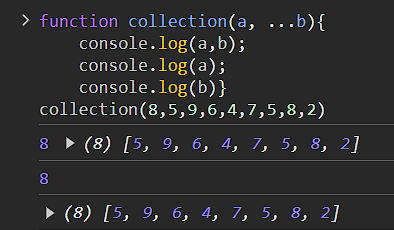

### *All About Function in JavaScript*
[*inspired by ~ Tspascript Bangla*](https://www.youtube.com/watch?v=PHEoUYWcKMc)
***
1. ##### *What is Function❓*
    ✔️ *Is a group of reusable Instructions which helps us to avoid repetition of Codes..*
1. ##### *What is Parameter❓*
    ✔️ *A parameter in a function is a variable that is used to pass information into a function. Parameters act as placeholders for the values, that will be provided when the function is called. They allow functions to be more flexible and reusable by enabling them to operate on different inputs...*
2. ##### *What is Argument❓*
    ✔️ *argument is a value that is passed to a function when the function is called. It is the actual data or input provided to the function’s parameters, enabling the function to operate on that data...*
3. ##### *Terminologies❓*
    ✔️ *Functions & Methods..*
    ✔️ *Declaration & Definition..*
    ✔️ *Arguments & Parameters..*
    ✔️ *CallBack & Higher-Order-Function..*

4. ##### *Methods❓*
    ✔️ *Methods are key value pair objects, it can be a primitive or non-primitive value of a key, Array methods, string methods, as an example **console** is an object and log is it's one of it's key, which one hold a function so called **log()**....so whenever it's a value of a key inside an object, will be a method, other wise a function.... **console.log()**..*
5. ##### *What is Declaration and Definition❓*
    ✔️ *in simple words Creating a Function and defining it with a unique name, called definition*
    
    
     *and declaring it by a variable name to execute all the terms in that very function, is called Declaration..*
     


6. ##### *What is default parameter in a Function❓*
    ✔️ *Default parameter in a function is a parameter that assumes a default value if a value is not provided for it when the function is called. This allows the function to be more flexible, as it can be called with fewer arguments while still operating correctly...*
    


7. ##### *what is Rest parameter in a function❓*
    ✔️ *Rest parameter in JavaScript allows a function to accept an indefinite number of arguments as an array. This is useful when we want to work with a variable number of arguments, rather than specifying them individually...*
    
    *We can loop through on rest parameter return result*

    _**Rest Parameters Must Be the Last Parameter:** In the function definition, the rest parameter must be the last parameter, as it collects all the remaining arguments into an array._

    _**Differences from arguments Object:** The rest parameter is a real array instance, so it has all the array methods available (map, filter, reduce, etc.), unlike the arguments object, which is array-like but not a real array._

    _**Cannot Combine with Other Rest Parameters:** You can only have one rest parameter in a function._

    **Example of best use Cases**
    


8. ##### *Difference between arrow and regular Function❓*
    ✔️ Arrow functions and regular functions in JavaScript have several key differences in terms of syntax, behavior, and usage. Here's a breakdown of the main differences:
#### 1. **Syntax:**

**Regular Function:**

```javascript

    function add(a, b) {
        return a + b;
    }
```

**Arrow Function:**


```javascript 
    const add = (a, b) => a + b;
```

Arrow functions are more concise, especially when the function body is simple. If the function has a single expression, it can omit the return keyword and the curly braces {}.


#### 2. ***this Context:***

***Regular Function:***
The value of this inside a regular function depends on how the function is called. It can change dynamically based on the calling context.

```    javascript

const person = {
    name: "Alice",
    greet: function() {
        console.log(`Hello, my name is ${this.name}`);
    }
};

```

```
person.greet(); // Output: "Hello, my name is Alice"
```

***Arrow Function:***

Arrow functions do not have their own this context. Instead, they inherit this from the surrounding scope (lexical this). This means that this inside an arrow function is always the same as this in the context where the arrow function was defined.

```javascript

    const person = {
        name: "Alice",
        greet: () => {
            console.log(`Hello, my name is ${this.name}`);
        }
    };
    person.greet(); // Output: "Hello, my name is undefined"
```

In the example above, this.name is undefined because this in the arrow function refers to the global object (or undefined in strict mode), not the person object.

#### 1. arguments Object:

***Regular Function:***
Regular functions have access to the arguments object, which is an array-like object containing all the arguments passed to the function.

 ```   javascript

function sum() {
    return Array.from(arguments).reduce((acc, curr) => acc + curr, 0);
}

console.log(sum(1, 2, 3)); // Output: 6
```

***Arrow Function:***

Arrow functions do not have their own arguments object. If you need access to arguments, you must use a regular function or the rest parameter.

```javascript

    const sum = (...args) => args.reduce((acc, curr) => acc + curr, 0);

    console.log(sum(1, 2, 3)); // Output: 6
```

#### ***4. new Keyword:***

***Regular Function:***

Regular functions can be used as constructors with the new keyword to create instances of an object.

```javascript

function Person(name) {
    this.name = name;
}

const alice = new Person("Alice");
console.log(alice.name); // Output: "Alice"
```


***Arrow Function:***

Arrow functions cannot be used as constructors, and attempting to use new with an arrow function will result in an error.


```javascript

    const Person = (name) => {
        this.name = name;
    };

    const alice = new Person("Alice"); // Error: Person is not a constructor
```

### Use Cases:

**Regular Function:**
    Regular functions are versatile and can be used in almost any context, including as constructors, methods on objects, or for functions requiring dynamic this binding.

   **Arrow Function:**
        _Arrow functions are ideal for short functions, especially in callbacks (e.g., in array methods like map, filter, etc.), and when you want to maintain the this context from the surrounding scope._


9. ##### *nested Function❓*
    ✔️ *In a nested function child function can access the value of parent functions parameter but parent can't access child's parameters or declared variables ..*
    ```javascript
        function parent(a){
    console.log("Parent function Executed"); // Parent function Executed
        let b = 25; 
    function child(){
            console.log("Child function Executed");
            let c = 10;
            return (a * b * c)
    }

    try{
        console.log("a + b =",a + b); //a + b = 35
        console.log("a + b + c =", a + b + c); //c is not defined
    }catch(error){
        console.log(error.message);
    }
    finally{
        return child;
        }
    }


    const result = parent(10);

    console.log(result()) //2500

    ```
10. ##### *What is CallBack Function❓*
    ✔️ Callback functions are functions passed as arguments to other functions and executed after some operation is completed.
    1. _They can be used for synchronous or asynchronous tasks._
    2. _Common use cases include event handling, asynchronous operations, and array methods._
    ```javascript
    <!-- As Event Listener -->
        document.getElementById("btn").addEventListener("click", function() {
    console.log("I'm clicked!");
    });
    ```
    ```javascript
    <!-- As Array Methods -->

        const numbers = [1, 2, 3, 4, 5];

        const doubled = numbers.map(function(number) {
            return number * 2;
        });

        console.log(doubled);
    ```
    3. _Although powerful, callbacks can lead to complex code structures like "callback hell," which can be addressed with Promises or async/await..._
    ```javascript
        setTimeout(function() {
            console.log("First task");
                setTimeout(function() {
                    console.log("Second task");
                    setTimeout(function() {
                        console.log("Third task");
                }, 1000);
            }, 1000);
        }, 1000);
    ```
11. ##### *What is Higher order Function❓*
    ✔️ *_Higher order function is either taking one or more functions as parameter or returning a function as results._*
    
    ###### _Example-01_
    
    _This **findEvenNumber** is an example of taking one function as parameter to get the even numbers from it's input parameter **arr**, which is an Array_ 
    ``` javascript
    function findEvenNumbers(arr, callBackFun){
    let evenArr = [];
    let oddArr = [];
    for(let ar of arr){
        if(callBackFun(ar)){
            evenArr.push(ar);
        }
        else{
            oddArr.push(ar)
        }
    }
    console.log(oddArr);
    return evenArr;
    }
    const numbers = [12, 54, 55, 7, 6, 23, 84, 14];
    const even = (param)=>{
        return (
            param % 2 === 0
        )
    }
        console.log(findEvenNumbers(numbers,even));
    ```

    ###### *Example-02*

    ```javascript
    function higherOrder(number){
        return function multiplier(times){
            return number * times;
        }
    }
    let multiplyDouble = higherOrder(20);
    let multiplyTriple = higherOrder(30);

    console.log(multiplyDouble(2));
    console.log(multiplyTriple(3));
    ```


12. ##### *What is Function❓*
    ✔️ *Is a group of reusable Instructions..*
13. ##### *What is Function❓*
    ✔️ *Is a group of reusable Instructions..*
14. ##### *What is Function❓*
    ✔️ *Is a group of reusable Instructions..*
15. ##### *What is Function❓*
    ✔️ *Is a group of reusable Instructions..*
16. ##### *What is Function❓*
    ✔️ *Is a group of reusable Instructions..*
17. ##### *What is Function❓*
    ✔️ *Is a group of reusable Instructions..*
18. ##### *What is Function❓*
    ✔️ *Is a group of reusable Instructions..*
19. ##### *What is Function❓*
    ✔️ *Is a group of reusable Instructions..*
20. ##### *What is Function❓*
    ✔️ *Is a group of reusable Instructions..*
21. ##### *What is Function❓*
    ✔️ *Is a group of reusable Instructions..*
22. ##### *What is Function❓*
    ✔️ *Is a group of reusable Instructions..*
23. ##### *What is Function❓*
    ✔️ *Is a group of reusable Instructions..*
24. ##### *What is Function❓*
    ✔️ *Is a group of reusable Instructions..*